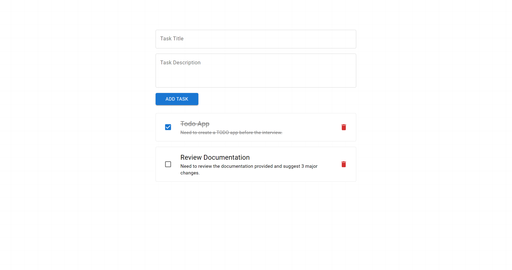

# React TODO App

A responsive task manager built using React and Material UI.  
Users can add tasks with a **title and description**, mark them as complete, and delete them with confirmation.

## Prerequisites

Make sure you have [Node.js](https://nodejs.org/) installed (version 16 or higher recommended). This project was built on Node.js v20.17.0 and npm v10.8.2.

To verify installation, run:

```bash
node -v
npm -v
```

## Demo



## Features

* Add a new task with a title and description
* Mark tasks as completed
* Delete tasks
* Clean, responsive UI built with MUI.

## Installation

To get started, you can either:

### A) Clone the repository and install dependencies:

```bash
git clone https://github.com/Pradhyumnaa/todo-app.git
cd todo-app
npm install
```

### B) Or download the ZIP

[Download ZIP](https://github.com/Pradhyumnaa/todo-app/archive/refs/heads/main.zip)

After downloading:

1. Extract the ZIP file
2. Open the inner `todo-app-main` folder
3. Open a terminal in that folder
4. Run:

```bash
npm install
```

## Usage

Run the development server with:

```bash
npm start
```

Then open your browser and go to:

[http://localhost:3000](http://localhost:3000)